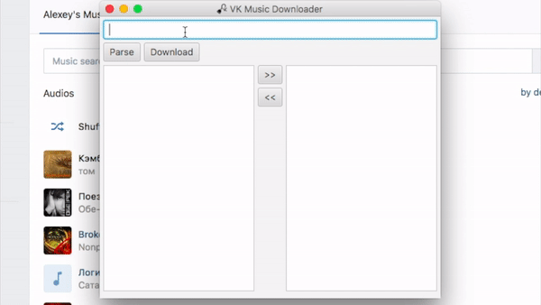

java-vkmd
=========

[](https://travis-ci.org/bupy7/java-vkmd)

A lighten music downloader for Vkontakte.



Requirements
------------

- Java >= 8.0

Run
---

```bash
$ ./vkmd
```

or [download](https://github.com/bupy7/java-vkmd/releases) latest package for your OS (Windows or macOS).

Developing
----------

- Gradle >= 4.10.2

### Build

```bash
$ ./gradlew build
```

### Run

```bash
$ ./gradlew run
```


### Testing

```bash
$ ./gradlew test
```

License
-------

java-vkmd is released under the BSD-3-Clause License. See the bundled LICENSE.md for details.
